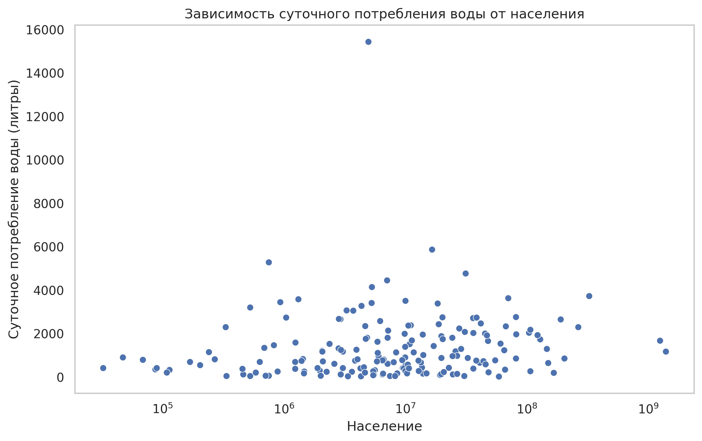

---
:::{note} Техническое задание
:class: dropdown
1. Выберите любой открытый датасет и скачайте открытый датасет, соответствующий вашим интересам или области обучения.
2. Создайте новую базу данных в системе управления базами данных (например, SQLite, PostgreSQL).
3. Создайте таблицу (или несколько таблиц) в базе данных с различными типами данных (INTEGER, TEXT, DATE), которые требуются для вашего датасета. Импортируйте данные из датасета в созданные таблицы.
4. Напишите несколько SQL-запросов для извлечения данных из таблиц базы данных. Используйте условия фильтрации (например, WHERE) для получения нужных данных.
5. Напишите SQL-запросы, использующие агрегатные функции (SUM, AVG, COUNT) для выполнения расчетов по данным таблицы.
6. Визуализируйте данные. Используйте библиотеки Python, такие как Matplotlib или Seaborn, для визуализации данных, извлеченных из базы данных. Постройте графики или диаграммы, которые помогут проанализировать и понять данные.
:::
---
Графики анализа датасета
---
1. Топ-10 стран по суточному потреблению воды на душу населения

2. Топ-10 стран по годовому потреблению воды

3. Зависимость суточного потребления воды от населения

4. Ящик с усами для суточного потребления воды на душу населения

---

:::{important} Общий анализ данных

Страны с наибольшим потреблением воды на душу населения

Туркменистан лидирует с огромным ежедневным потреблением на душу населения — 15,445 литров. Это можно объяснить:
- Засушливым климатом, требующим интенсивного орошения в сельском хозяйстве.
- Сильной зависимостью экономики от водоёмких культур, таких как хлопок.

Чили занимает второе место с 5,880 литров в день, что связано с сельским хозяйством (например, выращивание винограда для виноделия) и добывающей промышленностью.

В странах, таких как Гайана, Узбекистан и Таджикистан, высокое потребление воды также обусловлено интенсивным использованием воды в сельском хозяйстве, особенно для орошения.

---
Страны с наименьшим потреблением воды на душу населения

Демократическая Республика Конго (ДР Конго) и Республика Конго имеют одни из самых низких уровней ежедневного потребления воды на душу населения — 32–38 литров.

Причины:

- Ограниченный доступ к водным ресурсам для населения.
- Низкий уровень урбанизации и промышленного использования воды.

Центральноафриканская Республика, Бенин и Мальдивы также показывают низкий уровень потребления воды (менее 50 литров в день на человека), что связано с бедностью, слабой инфраструктурой и ограниченным доступом к централизованным системам водоснабжения.

---

Беларусь

В Беларуси ежедневное потребление воды на душу населения составляет 419 литров, что ниже среднего значения (1,329 литров). Это можно объяснить:
- Умеренным климатом, который снижает потребность в орошении.
- Развитыми технологиями водосбережения в промышленности и сельском хозяйстве.
- Умеренным уровнем урбанизации и высоким уровнем управления водными ресурсами.

---

 Среднее значение потребления воды

Среднее ежедневное потребление воды на душу населения для всех стран в данных составляет 1,329 литров. Это значение показывает, что:
- Страны с высокими показателями (например, Туркменистан) значительно превышают этот уровень, что поднимает вопросы об эффективности использования воды.
- Множество стран с низким потреблением (например, ДР Конго) находятся далеко ниже среднего, что может свидетельствовать о нехватке воды или ограничениях в доступе.

---
 Возможные ключевые факторы, влияющие на данные
- Климатические условия

Страны с жарким климатом (например, Туркменистан, Узбекистан, Таджикистан) потребляют больше воды из-за необходимости орошения сельскохозяйственных земель и поддержания нормальных условий жизни.
- Сельское хозяйство

Туркменистан, Узбекистан и Таджикистан используют значительные объёмы воды для выращивания водоёмких культур, таких как хлопок.
Низкий уровень потребления в странах, таких как ДР Конго, объясняется меньшим использованием воды в сельском хозяйстве.
- Экономическое развитие

Страны с низким уровнем потребления воды (например, ДР Конго, ЦАР, Бенин) имеют слабую инфраструктуру, что ограничивает доступ к воде даже для базовых нужд.
В Беларуси умеренный уровень потребления воды может быть результатом более рационального использования ресурсов и развитой инфраструктуры.
:::

<!-- Шаг 1: Создание новой базы данных
CREATE DATABASE water_using_data;
Шаг 2: Подключение к новой базе данных
USE water_using_data;
Шаг 3: Создание таблицы для хранения данных из CSV-файла
CREATE TABLE water_usage (
    country VARCHAR(255),
    yearly_water_used DECIMAL(20, 2),
    daily_water_used_per_capita DECIMAL(20, 2),
    population INT
);
ШАГ 4. Импорт данных
LOAD DATA INFILE '/var/lib/mysql-files/water_use_by_country_cleaned.csv'
INTO TABLE water_usage
FIELDS TERMINATED BY ',' 
ENCLOSED BY '"' 
LINES TERMINATED BY '\n'
IGNORE 1 ROWS; -->
